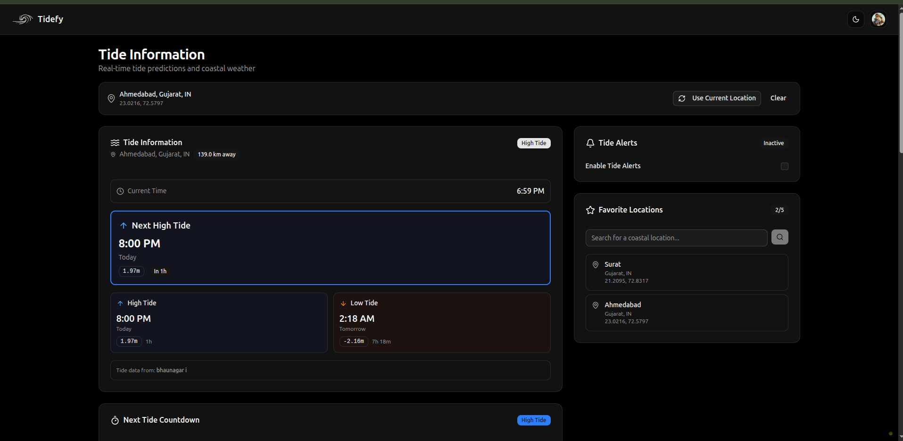
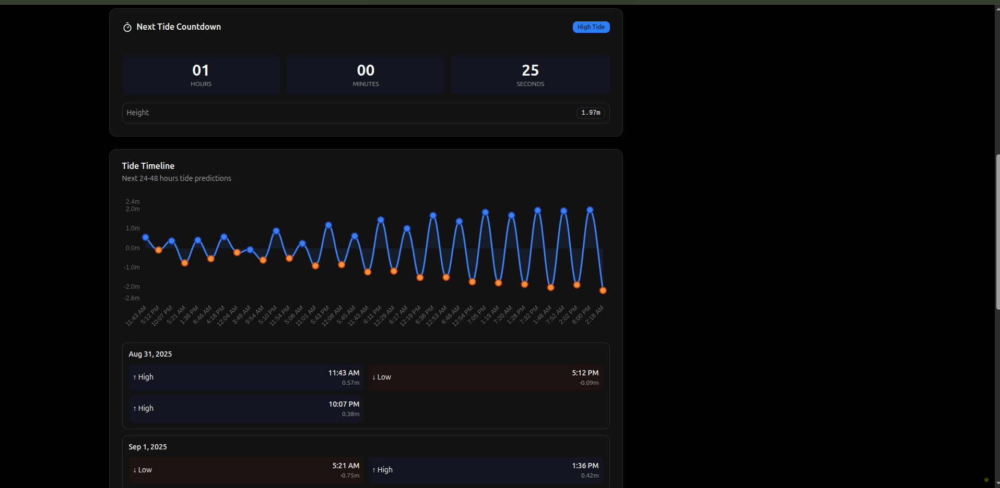
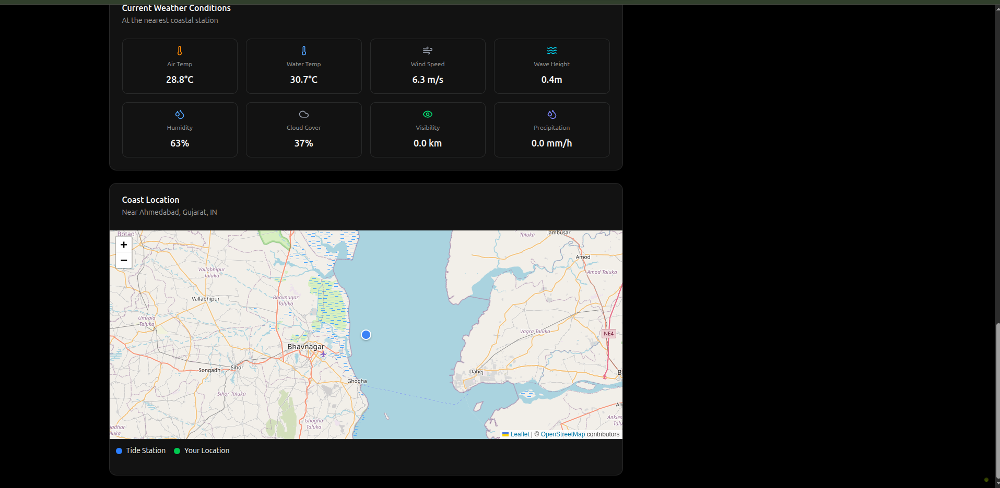

# tide-info

## Caution: VibeCoding Ahead

# Dashboard Demo








## Getting Started

First, install the dependencies:

```bash
bun install
```
## Database Setup

This project uses SQLite with Drizzle ORM.

1. Start the local SQLite database:
```bash
cd apps/server && bun db:local
```


2. Update your `.env` file in the `apps/server` directory with the appropriate connection details if needed.

3. Apply the schema to your database:
```bash
bun db:push
```


Then, run the development server:

```bash
bun dev
```

Open [http://localhost:3001](http://localhost:3001) in your browser to see the web application.
The API is running at [http://localhost:3000](http://localhost:3000).


## Project Structure

```
tide-info/
├── apps/
│   ├── web/         # Frontend application (React + TanStack Router)
│   └── server/      # Backend API (Hono)
```

## Available Scripts

- `bun dev`: Start all applications in development mode
- `bun build`: Build all applications
- `bun dev:web`: Start only the web application
- `bun dev:server`: Start only the server
- `bun check-types`: Check TypeScript types across all apps
- `bun db:push`: Push schema changes to database
- `bun db:studio`: Open database studio UI
- `cd apps/server && bun db:local`: Start the local SQLite database
